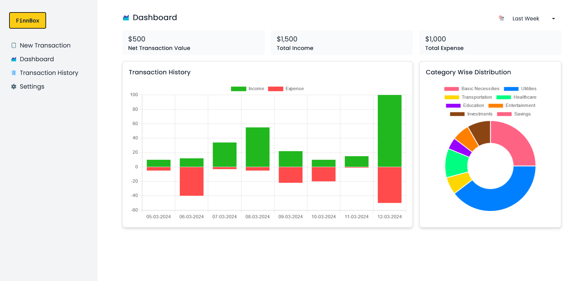
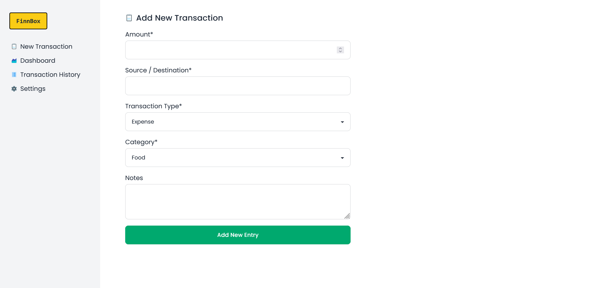

# 📊 Finn-Box: Your Personal Finance Manager

Finn-Box is your go-to personal finance manager, designed to simplify and streamline your financial journey. 💼💰

**Development still in progress. Only UI compete.**

🖼️ View more screenshots.

 

### Key Features:
- 🌟 **Intuitive Interface**: Enjoy a user-friendly experience for managing your finances effortlessly. 
- 💹 **Comprehensive Dashboard**: Get a holistic view of your financial health at a glance. 
- 📅 **Transaction History**: Keep track of all your transactions with ease. 
- 📝 **Customizable Records**: Add new records seamlessly to stay organized. 

### Technologies Used:
**Frontend:**
1. Next.js 14
2. DaisyUI
3. Charts.js

**Backend:**
*(Technologies planned to be used.)*
1. Node.js
2. Express.js
3. PrismaORM

### License:
This project is licensed under the MIT License, giving you the freedom to use and modify it as you see fit. 📜🔒